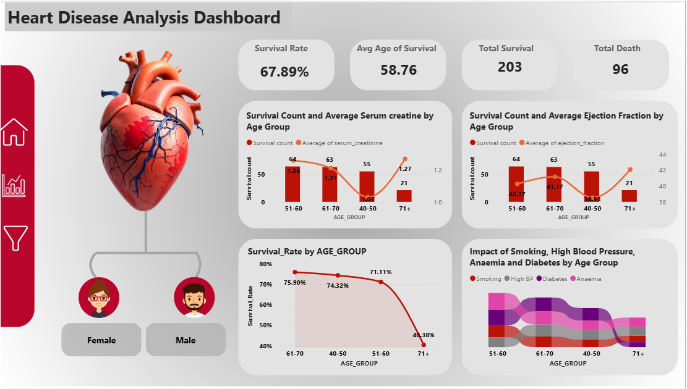

# Heart-Disease-Analysis- Power BI
## Project Objective
The Heart Disease Analytics Dashboard is designed to analyze clinical factors that contribute to heart failure and predict patient mortality. By examining physiological indicators (like ejection fraction and serum creatinine), the project aims to identify high-risk patient profiles to enable early medical intervention and better resource allocation in healthcare settings.
## Objectives
- Identify Mortality Drivers: Determine which clinical features (e.g., age, serum creatinine, ejection fraction) have the strongest correlation with DEATH_EVENT.
- Demographic Profiling: Analyze how heart disease risk varies across gender and age groups.
- Comorbidity Assessment: Evaluate the impact of secondary conditions like diabetes, anaemia, and high blood pressure on patient outcomes.
- Risk Segmentation: Categorize patients into risk tiers based on their lab results and lifestyle factors (smoking).
## KPI"S Performances:
Based on the dashboard and data, the following metrics serve as the primary KPIs:
- Mortality Rate: The percentage of patients who suffered a DEATH_EVENT (roughly 32% based on the dataset).
- Average Ejection Fraction: A key indicator of heart pumping strength (Avg ~38%).
- Average Serum Creatinine Levels: A marker for kidney function, which often fluctuates in heart failure patients (Avg ~1.4 mg/dL).
- Average Age: The mean age of the patient cohort (Avg ~60.8 years).
- Gender Distribution Ratio: The balance between male and female patients in the study.
## Dashboards
### Power BI Dashboard
  
## Insights:
- Critical Biomarkers: High Serum Creatinine and low Ejection Fraction are the most significant predictors of mortality. Patients with an ejection fraction below 30% show a drastically higher death rate.
- Age Factor: Mortality risk increases significantly after age 60, with the highest concentration of deaths occurring in the 70–80 age bracket.
- The "Time" Variable: The time feature (follow-up period) shows a strong inverse correlation with mortality, suggesting that patients who survived longer without an event had better-managed symptoms.
- Gender Trends: Men represent a larger portion of the dataset (approx. 65%), yet mortality rates remain high across both genders when adjusted for age and comorbidities.
- Lifestyle Impact: While smoking is a known risk, the data shows it often compounds with high blood pressure to accelerate heart failure incidents.
## Recommendations:
- Targeted Monitoring: Prioritize patients with Serum Creatinine $> 1.5$ for intensive care, regardless of whether they show severe physical symptoms.
- Early Screening for Seniors: Implement mandatory cardiac screenings for patients over 65, focusing on ejection fraction tests.
- Integrated Treatment: For patients with diabetes and heart disease, a multidisciplinary approach involving both cardiologists and endocrinologists is essential.
- Lifestyle Intervention Programs: Develop aggressive smoking cessation and blood pressure management programs for middle-aged male patients (45–60).
## Critical Takeways:
- Thresholds Matter: Clinical "danger zones" identified include Serum Creatinine $ 1.5 and Ejection Fraction $ 35.
- Silent Killers: Diabetes and Anaemia are prevalent in nearly 40-45% of the deceased cases, acting as major complicating factors.
## Author
Name: Makala Deepak
📧 Contact: [Makala Deepak](https://www.linkedin.com/in/makala-deepak-63471425a/)
